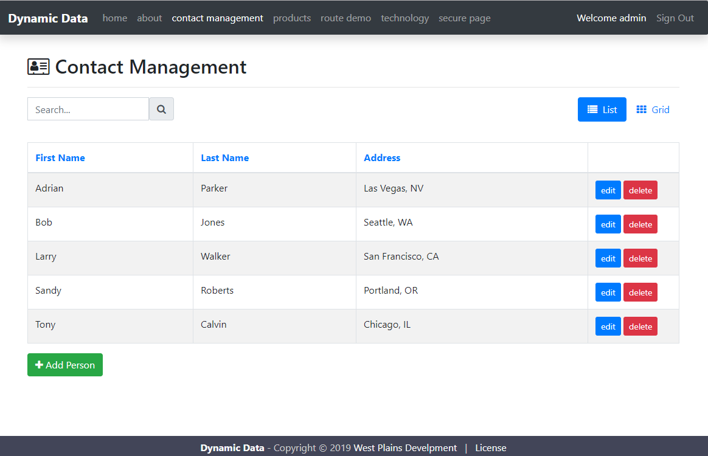

# read-views-create-links

Dynamically create links and content from the views in the application.

## Instructions

Using `npm install` download and install all of the necessary dependencies

`nodemon` will be installed, so you can change any node based JavaScript, html, etc.the server will reload for you.

Use `npm start` to fire up the server and access it in the browser at `localhost:/3010`

## What happens?

When the server first starts up, the `file.service.js` file will read all of the handlebar views which live under `views/pages/` from there
it will trim off the `.hbs` extension, remove any underscores or hyphens which can be used to separate words, and then create an object from found file and assign the link, the title, and let the object know if it's the active view.

Inside the `routes/index.js` file, the `register` function takes the current route, creates it's file list for the navigation and creates the title for the current page. Last, it will also query a `page-content` folder and look for any named markdown files which match with the route/view being created. If it does find a matching markdown file, the contents will be rendered as html and will be added to the file before being sent to the server. Depending on if you're in the root or a named route,the two navigation endpoints will render a server side handlebars page and serve it to the browser at `localhost:/3010`.

Adding additional handlebars pages to the `views/pages/` directory will automatically add those pages to the navigation. Additionally, there are a couple of single page application in this current collection of pages. As you will see, they too are automatically added to the collection and will render
as a normal page and have all of the functionality you would expect from a client side framework.

## Notes

The look and feel is simple Bootstrap 4. The AngularJS single page applications that were added were older applications built using Bootstrap 3 and only needed a few markup tweeks to tranistion into Bootstrap 4 which then made them fit in with the overall look and feel of the parent application.
